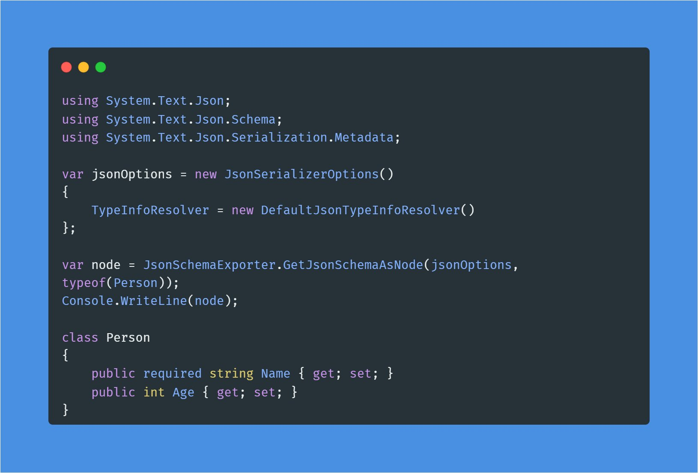

# How to emit descriptions for exported JSON schema using JsonSchemaExporter

We now (.NET 9+) have an API to export a JSON schema from a .NET type:

<figure><figcaption></figcaption></figure>

The default exporter will not, however, provide descriptions for those properties, even if a `[Description(...)]`attribute is provided. The way to fix that is to provide a `TransformSchemaNode` callback like so:

```csharp
var node = JsonSchemaExporter.GetJsonSchemaAsNode(options, typeof(Product), new JsonSchemaExporterOptions 
{ 
    TreatNullObliviousAsNonNullable = true, 
    TransformSchemaNode = (context, node) =>
    {
        var description = context.PropertyInfo?.AttributeProvider?.GetCustomAttributes(typeof(DescriptionAttribute), false)
            .OfType<DescriptionAttribute>()
            .FirstOrDefault()?.Description;

        if (description != null)
            node["description"] = description;

        return node;
    },
});
```

